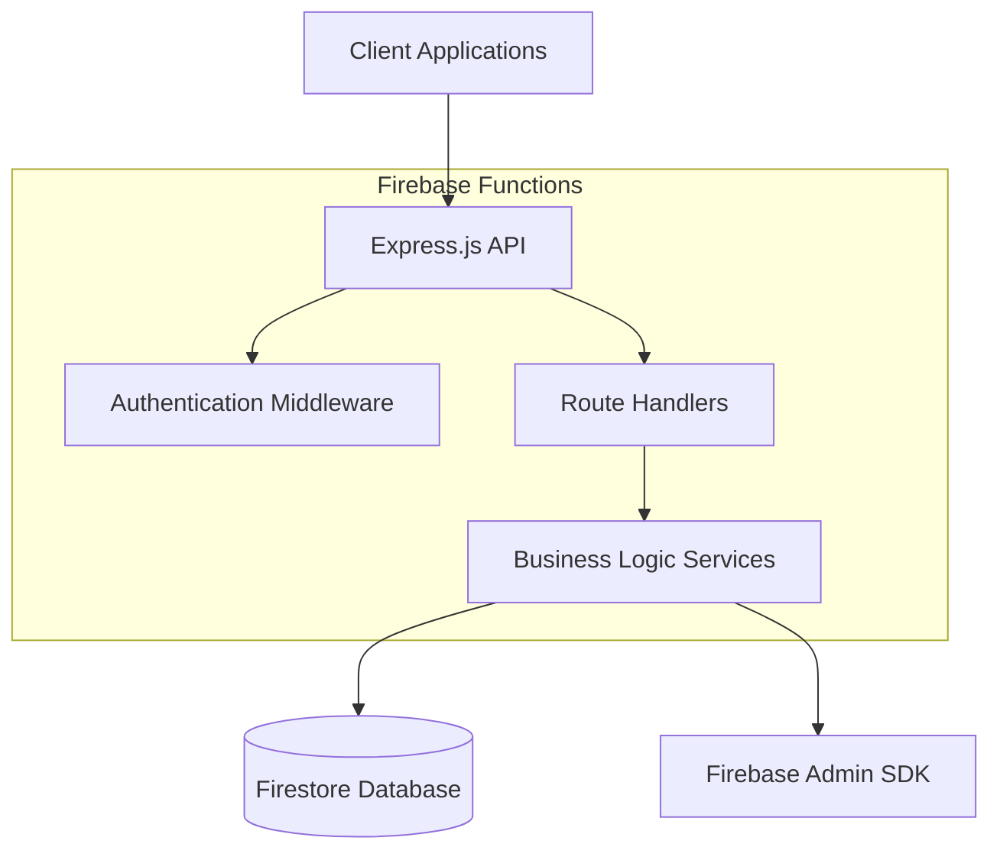
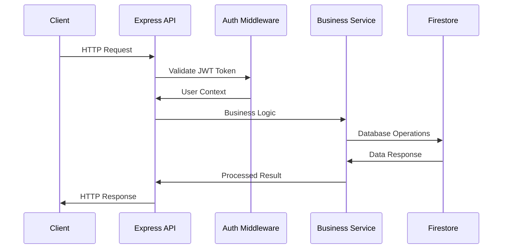

# Design Document - Booking Platform API

## Overview

The Booking Platform API is a RESTful service built with Express.js and Firebase Functions, using Firestore as the database. The system enables clients to book services from providers, with JWT-based authentication, balance management, and comprehensive booking history tracking.

### Key Design Principles
- **Security First**: JWT authentication with role-based authorization
- **Data Consistency**: Atomic operations for financial transactions
- **Scalability**: Leveraging Firebase Functions for auto-scaling
- **Maintainability**: Clean separation of concerns with modular architecture

## Architecture

### High-Level Architecture



### Request Flow



## Components and Interfaces

### 1. Authentication System

#### JWT Token Structure
```typescript
interface JWTPayload {
  userId: string;
  email: string;
  userType: 'client' | 'provider';
  iat: number;
  exp: number;
}
```

#### Authentication Middleware
- **Purpose**: Validate JWT tokens and extract user context
- **Location**: `src/middleware/auth.ts`
- **Responsibilities**:
  - Token validation and decoding
  - User context injection into requests
  - Role-based access control

### 2. User Management

#### User Data Model
```typescript
interface User {
  id: string;
  fullName: string;
  nif: string;
  email: string;
  passwordHash: string;
  userType: 'client' | 'provider';
  balance: number;
  createdAt: Date;
  updatedAt: Date;
  isActive: boolean;
}
```

#### User Service Interface
```typescript
interface UserService {
  register(userData: RegisterRequest): Promise<User>;
  authenticate(email: string, password: string): Promise<string>; // Returns JWT
  getUserById(userId: string): Promise<User>;
  updateBalance(userId: string, amount: number, transaction: FirebaseFirestore.Transaction): Promise<void>;
}
```

### 3. Service Management

#### Service Data Model
```typescript
interface Service {
  id: string;
  name: string;
  description: string;
  price: number;
  providerId: string;
  providerName: string;
  isActive: boolean;
  createdAt: Date;
  updatedAt: Date;
}
```

#### Service Management Interface
```typescript
interface ServiceManager {
  createService(serviceData: CreateServiceRequest, providerId: string): Promise<Service>;
  getServicesByProvider(providerId: string): Promise<Service[]>;
  getAllActiveServices(): Promise<Service[]>;
  updateService(serviceId: string, updates: Partial<Service>, providerId: string): Promise<Service>;
  deleteService(serviceId: string, providerId: string): Promise<void>;
}
```

### 4. Booking System

#### Booking Data Model
```typescript
interface Booking {
  id: string;
  clientId: string;
  clientName: string;
  serviceId: string;
  serviceName: string;
  providerId: string;
  providerName: string;
  amount: number;
  status: 'confirmed' | 'cancelled';
  createdAt: Date;
  cancelledAt?: Date;
  cancellationReason?: string;
}
```

#### Booking Service Interface
```typescript
interface BookingService {
  createBooking(clientId: string, serviceId: string): Promise<Booking>;
  cancelBooking(bookingId: string, userId: string, userType: string): Promise<Booking>;
  getBookingsByClient(clientId: string): Promise<Booking[]>;
  getBookingsByProvider(providerId: string): Promise<Booking[]>;
  getBookingHistory(filters?: BookingFilters): Promise<Booking[]>;
}
```

## Data Models

### Firestore Collections Structure

```
users/
├── {userId}/
    ├── fullName: string
    ├── nif: string (unique)
    ├── email: string (unique)
    ├── passwordHash: string
    ├── userType: 'client' | 'provider'
    ├── balance: number
    ├── createdAt: timestamp
    ├── updatedAt: timestamp
    └── isActive: boolean

services/
├── {serviceId}/
    ├── name: string
    ├── description: string
    ├── price: number
    ├── providerId: string
    ├── providerName: string
    ├── isActive: boolean
    ├── createdAt: timestamp
    └── updatedAt: timestamp

bookings/
├── {bookingId}/
    ├── clientId: string
    ├── clientName: string
    ├── serviceId: string
    ├── serviceName: string
    ├── providerId: string
    ├── providerName: string
    ├── amount: number
    ├── status: 'confirmed' | 'cancelled'
    ├── createdAt: timestamp
    ├── cancelledAt?: timestamp
    └── cancellationReason?: string
```

### Database Indexes
```json
{
  "indexes": [
    {
      "collectionGroup": "users",
      "fields": [
        {"fieldPath": "email", "order": "ASCENDING"},
        {"fieldPath": "isActive", "order": "ASCENDING"}
      ]
    },
    {
      "collectionGroup": "users",
      "fields": [
        {"fieldPath": "nif", "order": "ASCENDING"},
        {"fieldPath": "isActive", "order": "ASCENDING"}
      ]
    },
    {
      "collectionGroup": "services",
      "fields": [
        {"fieldPath": "providerId", "order": "ASCENDING"},
        {"fieldPath": "isActive", "order": "ASCENDING"}
      ]
    },
    {
      "collectionGroup": "bookings",
      "fields": [
        {"fieldPath": "clientId", "order": "ASCENDING"},
        {"fieldPath": "createdAt", "order": "DESCENDING"}
      ]
    },
    {
      "collectionGroup": "bookings",
      "fields": [
        {"fieldPath": "providerId", "order": "ASCENDING"},
        {"fieldPath": "createdAt", "order": "DESCENDING"}
      ]
    }
  ]
}
```

## API Endpoints Design

### Authentication Endpoints
- `POST /auth/register` - User registration
- `POST /auth/login` - User authentication

### User Management Endpoints
- `GET /users/profile` - Get current user profile
- `GET /users/balance` - Get current user balance

### Service Management Endpoints
- `POST /services` - Create service (providers only)
- `GET /services` - List all active services
- `GET /services/my` - Get provider's services (providers only)
- `PUT /services/:id` - Update service (providers only)
- `DELETE /services/:id` - Delete service (providers only)

### Booking Endpoints
- `POST /bookings` - Create booking (clients only)
- `GET /bookings/my` - Get user's bookings
- `PUT /bookings/:id/cancel` - Cancel booking
- `GET /bookings/history` - Get booking history (admin/filtered)

## Error Handling

### Error Response Format
```typescript
interface ErrorResponse {
  success: false;
  error: string;
  message: string;
  code?: string;
  details?: any;
}
```

### Error Categories
1. **Validation Errors** (400): Invalid input data
2. **Authentication Errors** (401): Invalid or missing JWT
3. **Authorization Errors** (403): Insufficient permissions
4. **Not Found Errors** (404): Resource not found
5. **Conflict Errors** (409): Duplicate data or business rule violations
6. **Server Errors** (500): Internal server errors

### Transaction Error Handling
- **Atomic Operations**: Use Firestore transactions for balance updates
- **Rollback Strategy**: Automatic rollback on transaction failures
- **Retry Logic**: Implement retry for transient failures
- **Logging**: Comprehensive error logging for debugging

## Testing Strategy

### Unit Testing
- **Authentication Middleware**: Token validation logic
- **Business Services**: Core business logic functions
- **Data Models**: Validation and transformation functions
- **Utilities**: Helper functions and validators

### Integration Testing
- **API Endpoints**: Full request-response cycle testing
- **Database Operations**: Firestore integration testing
- **Authentication Flow**: JWT generation and validation
- **Transaction Handling**: Balance update atomicity

### Test Data Management
- **Test Collections**: Separate Firestore collections for testing
- **Data Cleanup**: Automated test data cleanup
- **Mock Services**: Mock external dependencies
- **Test Users**: Predefined test users for different scenarios

### Performance Testing
- **Load Testing**: API endpoint performance under load
- **Database Performance**: Query optimization validation
- **Memory Usage**: Function memory consumption monitoring
- **Cold Start**: Firebase Functions cold start optimization

## Security Considerations

### Authentication Security
- **JWT Secret**: Secure JWT signing key management
- **Token Expiration**: Reasonable token expiration times
- **Password Hashing**: bcrypt for password hashing
- **Rate Limiting**: API rate limiting to prevent abuse

### Data Security
- **Input Validation**: Comprehensive input sanitization
- **SQL Injection Prevention**: Parameterized queries (Firestore native protection)
- **XSS Prevention**: Output encoding and CORS configuration
- **Data Encryption**: Sensitive data encryption at rest

### Authorization Security
- **Role-Based Access**: Strict role-based endpoint access
- **Resource Ownership**: Verify user owns resources before operations
- **Admin Functions**: Separate admin-only endpoints
- **Audit Logging**: Log all sensitive operations

## Performance Optimization

### Database Optimization
- **Composite Indexes**: Optimized queries with proper indexing
- **Query Limits**: Pagination for large result sets
- **Batch Operations**: Batch reads/writes where possible
- **Connection Pooling**: Efficient Firestore connection management

### Caching Strategy
- **User Sessions**: Cache user context during request lifecycle
- **Service Data**: Cache frequently accessed service information
- **Balance Queries**: Optimize balance retrieval patterns
- **Response Caching**: HTTP response caching for static data

### Function Optimization
- **Cold Start Reduction**: Minimize function initialization time
- **Memory Management**: Optimal memory allocation
- **Concurrent Requests**: Handle concurrent requests efficiently
- **Resource Cleanup**: Proper resource cleanup after requests